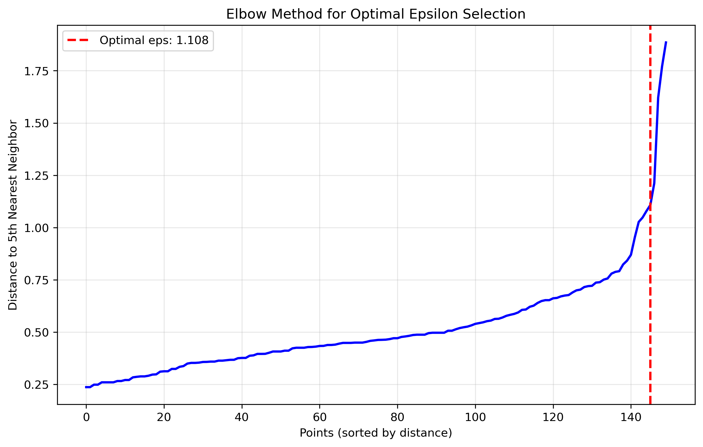
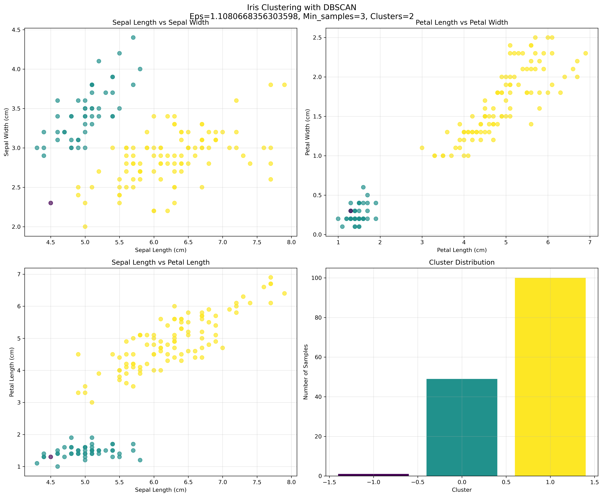
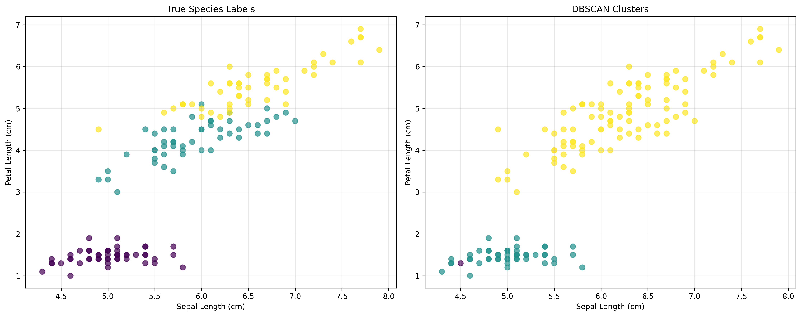

# DBSCAN Clustering on Iris Dataset

This project demonstrates density-based clustering using DBSCAN (Density-Based Spatial Clustering of Applications with Noise) on the famous Iris dataset. It includes automated parameter optimization and comprehensive visualization of clustering results, with comparison to true species labels.

## Motivation

I wanted to explore unsupervised learning techniques, particularly density-based clustering algorithms that can identify clusters of arbitrary shapes and handle noise effectively. The Iris dataset provides a perfect opportunity to demonstrate DBSCAN's capabilities on a well-known, real-world dataset with known ground truth.

## Features

- **Dataset**: Uses the classic Iris dataset from sklearn, a benchmark dataset in machine learning
- **Automated Parameter Optimization**: Implements the elbow method to find optimal epsilon values
- **Data Preprocessing**: Includes standardization for optimal clustering results
- **Comprehensive Visualization**: Multi-dimensional plots showing clustering results across different feature combinations
- **Ground Truth Comparison**: Compares DBSCAN clusters with true species labels
- **Results Analysis**: Detailed statistics for each identified cluster and species distribution

## Dataset

The project uses the **Iris dataset**, one of the most famous datasets in machine learning. It contains 150 samples of iris flowers with measurements of:
- Sepal length (cm)
- Sepal width (cm) 
- Petal length (cm)
- Petal width (cm)

The dataset includes three species: Setosa, Versicolor, and Virginica, making it perfect for demonstrating clustering algorithms.

## Methodology

The project follows a systematic approach:

1. **Data Loading**: Loads the Iris dataset from sklearn with all features and true labels
2. **Data Preprocessing**: Standardizes features to ensure equal importance in clustering
3. **Parameter Optimization**: Uses k-nearest neighbors to find optimal epsilon through the elbow method
4. **Clustering**: Applies DBSCAN with optimized parameters
5. **Analysis**: Visualizes results and compares with true species labels

## Setup

Install the required Python libraries:

```bash
pip install numpy pandas matplotlib scikit-learn seaborn
```

## Usage

```bash
git clone "https://github.com/Ivan-Koptiev/DBSCAN_iris"
```

Simply run the script to perform clustering on the Iris dataset:

```bash
python dbscan_clustering.py
```

## Outputs

The script generates several files:

- **`elbow_curve.png`**: Shows the elbow method for optimal epsilon selection
- **`iris_clustering.png`**: Multi-dimensional visualization of clustering results
- **`true_vs_predicted.png`**: Comparison between DBSCAN clusters and true species labels
- **`iris_clustering_results.csv`**: Detailed results with cluster assignments and true labels

## Results

### Elbow Method for Parameter Selection
The elbow curve helps identify the optimal epsilon value by finding the point of maximum curvature in the k-nearest neighbors distance plot.



### Clustering Results
Multi-dimensional visualization showing how iris samples are grouped based on their morphological features. Each subplot shows different feature combinations, and the bottom-right plot shows the distribution of samples across clusters.



### True vs Predicted Comparison
Side-by-side comparison of the true species labels (left) with DBSCAN clustering results (right), demonstrating how well the algorithm captures the natural groupings in the data.




## Clustering Results

Optimal epsilon: 1.108

Number of clusters: 2

Noise points: 1

Total samples: 150


## Cluster Statistics:

Noise: 1 samples

Cluster 0: 49 samples

  Avg Sepal Length: 5.02 cm

  Avg Sepal Width: 3.45 cm

  Avg Petal Length: 1.47 cm

  Avg Petal Width: 0.24 cm

Cluster 1: 100 samples

  Avg Sepal Length: 6.26 cm

  Avg Sepal Width: 2.87 cm

  Avg Petal Length: 4.91 cm

  Avg Petal Width: 1.68 cm

Species Distribution in Clusters:

Noise:

  setosa: 1

Cluster 0:

  setosa: 49

Cluster 1:

  versicolor: 50

  virginica: 50

## What I Learned

- **Density-Based Clustering**: Understanding how DBSCAN works by connecting points within a specified radius
- **Parameter Optimization**: Using the elbow method to find optimal epsilon values automatically
- **Noise Handling**: How DBSCAN naturally identifies and handles outliers as noise points
- **Data Preprocessing**: The importance of standardization for clustering algorithms
- **Ground Truth Validation**: Comparing unsupervised clustering results with known labels
- **Multi-dimensional Visualization**: Creating effective plots for high-dimensional clustering results
- **Real-world Applications**: Working with actual scientific data and interpreting results

## Challenges

- **Parameter Selection**: Finding the right balance between epsilon and min_samples for optimal results
- **Data Scaling**: Understanding when and how to standardize features for clustering
- **Interpretation**: Making sense of clustering results and comparing with domain knowledge
- **Visualization**: Effectively displaying multi-dimensional clustering results

## License

This project is licensed under the MIT License.
